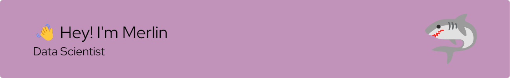

  
  

## 📖 About Me  
  

- 🔭 Looking for a new job opportunity  
  

- 🎓 I've a master's degree in computer science  
  

- 🌱 Currently learning Kubernetes and Rust  
  

- 🤔 My hobbies are going to the gym and learn new stuff  
  

   

## My Skill Set  
<table><tr><td valign="top" width="33%">

### Data *  

  
  
  
  
  
  
  
  
  
  

</td><td valign="top" width="33%">

### Programmation  

  
  
  
  
  
  

</td><td valign="top" width="33%">

### DevOps  

  
  
  
  

</td></tr></table>  

   

## Connect with me  

  

  
  

   

## Github Stats  

  

   
